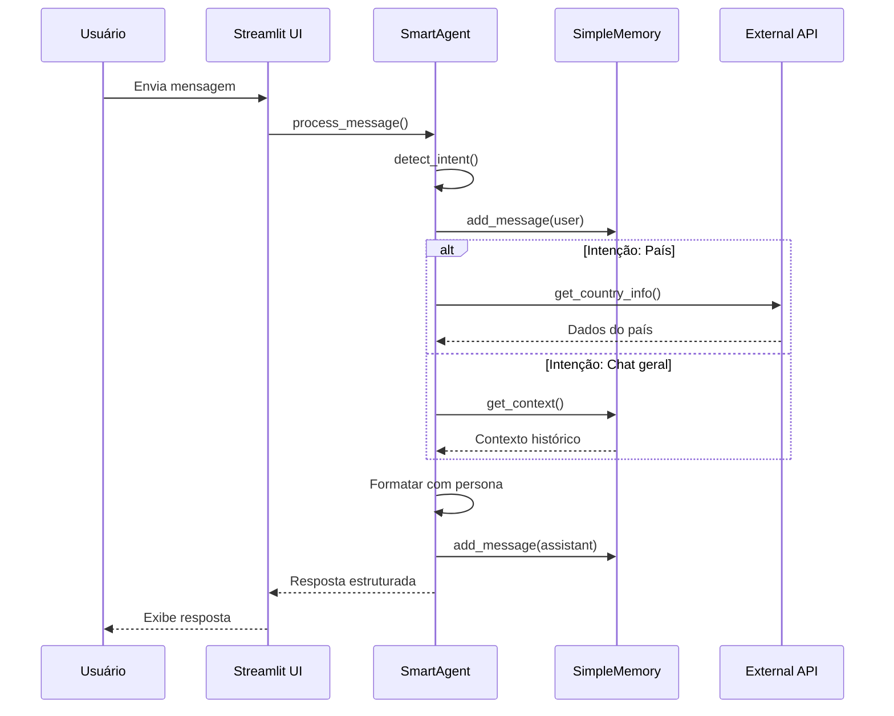

# 📚 Documentação Técnica

## Arquitetura do Sistema

O **OCI GenAI Chatbot v4** é construído com uma arquitetura modular que separa claramente as responsabilidades entre diferentes componentes. Esta documentação fornece uma visão detalhada da implementação técnica.

### Componentes Principais

#### 1. SmartAgent (Núcleo de Processamento)

A classe `SmartAgent` é o coração do sistema, responsável por:

- **Detecção de Intenções**: Analisa a entrada do usuário para determinar se deve usar ferramentas externas
- **Gerenciamento de Memória**: Mantém o contexto da conversa através da classe `SimpleMemory`
- **Processamento de Personas**: Adapta as respostas baseado na persona e estilo selecionados

```python
class SmartAgent:
    def __init__(self, persona: str, style: str):
        self.persona = persona
        self.style = style
        self.memory = SimpleMemory()
    
    def process_message(self, user_input: str) -> Dict[str, Any]:
        # Lógica de processamento principal
        pass
```

#### 2. SimpleMemory (Sistema de Memória)

Implementa uma janela deslizante para manter o contexto da conversa:

- **Capacidade Configurável**: Por padrão, mantém as últimas 10 trocas (20 mensagens)
- **Otimização Automática**: Remove mensagens antigas automaticamente
- **Recuperação de Contexto**: Fornece contexto relevante para o processamento

```python
class SimpleMemory:
    def __init__(self, max_turns=10):
        self.max_turns = max_turns
        self.messages = []
    
    def add_message(self, role: str, content: str):
        # Adiciona mensagem e gerencia capacidade
        pass
    
    def get_context(self) -> str:
        # Retorna contexto das últimas mensagens
        pass
```

#### 3. API Integration (Integração Externa)

O sistema integra com a API RestCountries para informações de países:

- **Endpoint**: `https://restcountries.com/v3.1/name/{country}`
- **Campos Consultados**: name, capital, population, region, subregion, area, languages
- **Tratamento de Erros**: Fallback gracioso para falhas de conectividade

```python
def get_country_info(country_name: str) -> str:
    try:
        response = requests.get(f"https://restcountries.com/v3.1/name/{country_name}?fields=name,capital,population,region,subregion,area,languages")
        response.raise_for_status()
        data = response.json()[0]
        # Formatação dos dados
        return formatted_info
    except Exception as e:
        return error_message
```

## Fluxo de Dados

### 1. Processamento de Mensagem



### 2. Detecção de Intenções

O algoritmo de detecção de intenções funciona através de:

1. **Normalização**: Converte a entrada para minúsculas
2. **Busca por Palavras-chave**: Procura por nomes de países em uma lista predefinida
3. **Mapeamento**: Converte nomes em português para inglês quando necessário
4. **Classificação**: Retorna `country_info:{país}` ou `general_chat`

```python
def detect_intent(self, user_input: str) -> str:
    user_lower = user_input.lower()
    
    countries = ['brasil', 'brazil', 'frança', 'france', ...]
    
    for country in countries:
        if country in user_lower:
            return f"country_info:{country}"
    
    return "general_chat"
```

## Configuração e Personalização

### Variáveis de Ambiente

O sistema suporta configuração através de variáveis de ambiente:

| Variável | Descrição | Padrão |
|----------|-----------|---------|
| `MEMORY_MAX_TURNS` | Número máximo de trocas na memória | 10 |
| `MEMORY_CONTEXT_WINDOW` | Janela de contexto para recuperação | 6 |
| `API_TIMEOUT` | Timeout para chamadas de API (segundos) | 10 |
| `DEBUG_MODE` | Ativa logs detalhados | false |

### Personas e Estilos

O sistema suporta 4 personas e 4 estilos de comunicação:

**Personas:**
- **Professor**: Didático, usa exemplos e analogias
- **Suporte Técnico**: Objetivo, estruturado, passo a passo
- **Contador de Histórias**: Narrativo, usa metáforas
- **Analista**: Focado em dados e insights

**Estilos:**
- **Formal**: Tom profissional e direto
- **Técnico**: Terminologia especializada
- **Simples**: Linguagem acessível
- **Empático**: Abordagem calorosa

## Performance e Otimizações

### Gerenciamento de Memória

- **Janela Deslizante**: Evita crescimento ilimitado da memória
- **Limpeza Automática**: Remove mensagens antigas automaticamente
- **Contexto Otimizado**: Recupera apenas as mensagens mais relevantes

### Cache e Otimizações de API

- **Timeout Configurável**: Evita travamentos em APIs lentas
- **Tratamento de Erros**: Fallback gracioso para falhas
- **Formatação Eficiente**: Processamento mínimo dos dados da API

### Interface de Usuário

- **CSS Customizado**: Estilos otimizados para performance
- **Componentes Reutilizáveis**: Estrutura modular da UI
- **Loading States**: Feedback visual durante processamento

## Extensibilidade

### Adicionando Novas APIs

Para adicionar uma nova API externa:

1. Crie uma função de integração seguindo o padrão:

```python
def get_new_api_info(query: str) -> str:
    try:
        # Lógica de consulta
        return formatted_result
    except Exception as e:
        return error_message
```

2. Adicione detecção de intenção no método `detect_intent()`
3. Inclua o processamento no método `process_message()`

### Adicionando Novas Personas

Para adicionar uma nova persona:

1. Adicione ao dicionário `PERSONAS`:

```python
PERSONAS["Nova Persona"] = "Descrição do comportamento"
```

2. Implemente a lógica de formatação no método `process_message()`

## Monitoramento e Logs

O sistema inclui capacidades básicas de monitoramento:

- **Feedback de Usuário**: Coleta através da interface
- **Métricas de Satisfação**: Calculadas automaticamente
- **Histórico de Interações**: Armazenado em SQLite

Para logs mais detalhados, configure `DEBUG_MODE=true` no arquivo `.env`.
