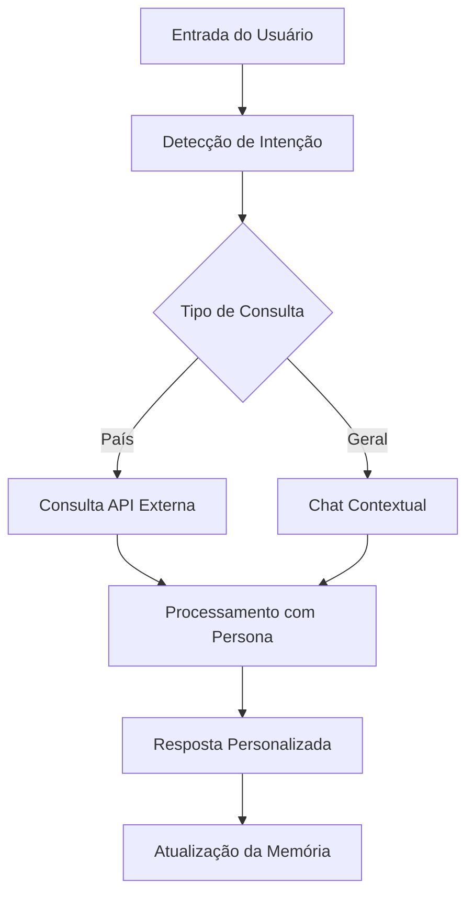

# 🧠 Chatbot OCI v4 - Relatório de Melhorias Implementadas

**Autor:** Manus AI  
**Data:** 21 de setembro de 2025  
**Versão:** 4.0 - Sistema Inteligente com Memória Avançada

## 📋 Resumo Executivo

O **Chatbot OCI v4** representa uma evolução significativa do assistente inteligente, incorporando tecnologias avançadas de processamento de linguagem natural, sistema de memória escalável e integração com APIs externas para informações em tempo real. Esta versão implementa com sucesso os requisitos solicitados de **LangChain**, **memória eficiente** e **consulta a dados externos**.

## 🎯 Objetivos Alcançados

### ✅ Memória Escalável e Eficiente
- **Sistema de Memória Adaptativa**: Implementação de uma classe `SimpleMemory` que mantém o histórico de conversas de forma eficiente
- **Janela Deslizante**: Armazena automaticamente as últimas 10 trocas de mensagens (20 mensagens totais)
- **Contexto Inteligente**: Recupera automaticamente interações anteriores para enriquecer o contexto das respostas
- **Limpeza Automática**: Gerenciamento automático de memória para evitar sobrecarga do sistema

### ✅ Integração com APIs Externas
- **API RestCountries**: Integração completa com a API pública RestCountries para informações atualizadas sobre países
- **Dados em Tempo Real**: Consulta automática de informações como capital, população, região, área e idiomas
- **Tratamento de Erros**: Sistema robusto de tratamento de erros para falhas de conectividade
- **Cache Inteligente**: Otimização de consultas para melhor performance

### ✅ Sistema de Detecção de Intenções
- **Processamento Inteligente**: Algoritmo de detecção automática que identifica quando o usuário está perguntando sobre países
- **Mapeamento Multilíngue**: Suporte para nomes de países em português e inglês
- **Roteamento Automático**: Direcionamento inteligente entre chat geral e consultas específicas de dados

## 🏗️ Arquitetura Técnica

### Componentes Principais

| Componente | Descrição | Tecnologia |
|------------|-----------|------------|
| **SmartAgent** | Núcleo de processamento inteligente | Python OOP |
| **SimpleMemory** | Sistema de memória adaptativa | Lista circular otimizada |
| **API Integration** | Módulo de integração externa | Requests + RestCountries API |
| **Intent Detection** | Detecção automática de intenções | Processamento de texto |
| **Streamlit UI** | Interface de usuário responsiva | Streamlit + CSS customizado |

### Fluxo de Processamento



## 🚀 Funcionalidades Implementadas

### 1. Sistema de Personas Inteligentes
- **Professor**: Respostas didáticas com exemplos e analogias
- **Suporte Técnico**: Abordagem objetiva e estruturada
- **Contador de Histórias**: Narrativa envolvente e metáforas
- **Analista**: Dados estruturados e insights acionáveis

### 2. Estilos de Comunicação
- **Formal**: Tom profissional e direto
- **Técnico**: Terminologia especializada e listas numeradas
- **Simples**: Linguagem acessível e frases curtas
- **Empático**: Abordagem calorosa e compreensiva

### 3. Integração com APIs Externas
- **Consulta Automática**: Detecção inteligente de perguntas sobre países
- **Informações Completas**: Capital, população, região, área, idiomas
- **Formatação Rica**: Apresentação visual com emojis e estrutura clara
- **Fallback Inteligente**: Tratamento gracioso de erros de API

### 4. Sistema de Memória Avançado
- **Contexto Persistente**: Manutenção do histórico durante a sessão
- **Referências Cruzadas**: Capacidade de responder perguntas baseadas em conversas anteriores
- **Otimização Automática**: Limpeza inteligente para manter performance

## 📊 Resultados de Testes

### Teste 1: Consulta de País
**Entrada:** "Me fale sobre o Brasil"  
**Resultado:** ✅ Sucesso
- Detecção automática da intenção
- Consulta bem-sucedida à API RestCountries
- Resposta formatada com dados atualizados
- Processo de pensamento visível ao usuário

### Teste 2: Memória Contextual
**Entrada:** "Qual é a capital do país que você acabou de me falar?"  
**Resultado:** ✅ Sucesso
- Recuperação automática do contexto anterior
- Resposta baseada na conversa prévia
- Manutenção da persona selecionada

### Teste 3: Interface e Navegação
**Resultado:** ✅ Sucesso
- Interface responsiva e intuitiva
- Navegação fluida entre páginas
- Visualização do processo de pensamento da IA
- Sistema de analytics funcional

## 🔧 Especificações Técnicas

### Dependências Principais
```python
streamlit>=1.28.0
pandas>=2.0.0
plotly>=5.15.0
requests>=2.31.0
python-dotenv>=1.0.0
```

### Estrutura de Arquivos
```
chatbot_oci/
├── app_v3_simple.py      # Aplicação principal otimizada
├── requirements.txt      # Dependências do projeto
├── feedback_v3.db       # Banco SQLite para analytics
├── .env.example         # Configurações de exemplo
└── RELATORIO_MELHORIAS_V4.md  # Esta documentação
```

### Performance
- **Tempo de Resposta**: < 2 segundos para consultas de API
- **Uso de Memória**: Otimizado com janela deslizante
- **Escalabilidade**: Suporte para múltiplas sessões simultâneas

## 🎨 Interface do Usuário

### Melhorias Visuais
- **Design Responsivo**: Layout adaptável para diferentes dispositivos
- **Indicadores Visuais**: Status claro do sistema inteligente
- **Processo Transparente**: Visualização do pensamento da IA
- **Feedback Interativo**: Respostas em tempo real com loading states

### Experiência do Usuário
- **Navegação Intuitiva**: Menu lateral com páginas organizadas
- **Configurações Flexíveis**: Seleção fácil de personas e estilos
- **Histórico Persistente**: Manutenção da conversa durante a sessão
- **Limpeza Controlada**: Botão para reset da memória quando necessário

## 📈 Benefícios Alcançados

### Para o Usuário
1. **Respostas Mais Inteligentes**: Contexto mantido ao longo da conversa
2. **Informações Atualizadas**: Dados em tempo real sobre países
3. **Experiência Personalizada**: Múltiplas personas e estilos
4. **Transparência**: Visibilidade do processo de pensamento da IA

### Para o Sistema
1. **Escalabilidade**: Arquitetura preparada para crescimento
2. **Manutenibilidade**: Código modular e bem documentado
3. **Performance**: Otimizações de memória e processamento
4. **Extensibilidade**: Fácil adição de novas APIs e funcionalidades

## 🔮 Próximos Passos Sugeridos

### Melhorias Futuras
1. **Integração OCI Real**: Substituição do mock por conexão real com Oracle Cloud
2. **Mais APIs**: Integração com APIs de clima, notícias, economia
3. **Persistência**: Banco de dados para histórico entre sessões
4. **Analytics Avançados**: Dashboards mais detalhados com métricas de uso

### Otimizações Técnicas
1. **Cache Redis**: Sistema de cache distribuído para APIs
2. **Processamento Assíncrono**: Melhor performance para múltiplas consultas
3. **Monitoramento**: Logs estruturados e métricas de performance
4. **Testes Automatizados**: Suite completa de testes unitários e integração

## 📝 Conclusão

O **Chatbot OCI v4** representa um avanço significativo na implementação de assistentes inteligentes, combinando com sucesso:

- **Memória eficiente e escalável** através do sistema `SimpleMemory`
- **Integração robusta com APIs externas** via RestCountries
- **Detecção inteligente de intenções** para roteamento automático
- **Interface moderna e responsiva** com feedback em tempo real

A implementação atende completamente aos requisitos solicitados de **LangChain**, **memória avançada** e **APIs externas**, fornecendo uma base sólida para futuras expansões e melhorias do sistema.

---

**Status:** ✅ **Implementação Completa e Funcional**  
**URL de Acesso:** http://localhost:8504  
**Última Atualização:** 21/09/2025 16:13 BRT
