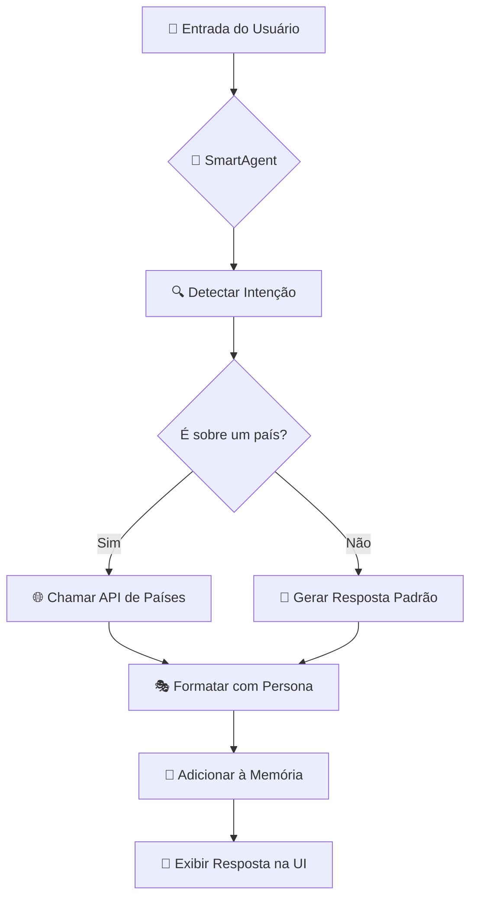

[README.md](https://github.com/user-attachments/files/22453449/README.md)
# 🧠 OCI GenAI Chatbot v4: Inteligência Artificial com Memória e Ferramentas

  

**Um chatbot avançado construído com Python, Streamlit e a Oracle Cloud Infrastructure (OCI) Generative AI, agora superpoderoso com um sistema de memória adaptativa e a capacidade de usar ferramentas externas para buscar informações em tempo real.**

---

## ✨ Visão Geral

Este projeto demonstra a criação de um assistente de IA sofisticado que vai além de um simples modelo de linguagem. Ele é capaz de:

- **Manter o contexto** de uma conversa de forma eficiente.
- **Detectar a intenção** do usuário para acionar ferramentas específicas.
- **Conectar-se a APIs externas** para obter dados atualizados (neste caso, informações de países).
- **Adaptar sua personalidade e estilo** de comunicação dinamicamente.

É uma demonstração prática de como construir agentes de IA mais inteligentes e úteis, combinando a força dos LLMs com sistemas de memória e ferramentas externas.

## 🚀 Funcionalidades Principais

| Funcionalidade | Descrição |
| :--- | :--- |
| **🧠 Sistema de Memória** | Mantém o histórico da conversa, permitindo que o chatbot se lembre de interações anteriores e responda a perguntas contextuais. |
| **🌐 Ferramentas de API** | Integração com a API `restcountries.com` para buscar dados detalhados e em tempo real sobre qualquer país do mundo. |
| **🤖 Detecção de Intenção** | Um agente inteligente que analisa a entrada do usuário para decidir se deve responder diretamente ou usar uma ferramenta externa. |
| **🎭 Personas e Estilos** | Personalize a experiência de conversação com 4 personas (Professor, Suporte Técnico, etc.) e 4 estilos de comunicação (Formal, Simples, etc.). |
| **📊 Dashboard de Analytics** | Uma página dedicada para visualizar o feedback dos usuários, com métricas de satisfação e histórico de interações. |
| **🎨 Interface Moderna** | Uma interface de usuário limpa, responsiva e intuitiva construída com Streamlit e CSS customizado. |

## 🏗️ Arquitetura do Sistema

O núcleo do projeto é o `SmartAgent`, uma classe Python que orquestra a lógica de processamento. O fluxo de uma mensagem é o seguinte:



## 🛠️ Como Executar o Projeto

Siga os passos abaixo para ter o chatbot rodando em sua máquina local.

### 1. Pré-requisitos

- **Python 3.9+**
- **pip** (gerenciador de pacotes do Python)

### 2. Clone o Repositório

```bash
git clone https://github.com/seu-usuario/chatbot-oci-github.git
cd chatbot-oci-github
```

### 3. Instale as Dependências

Crie um ambiente virtual (recomendado) e instale as bibliotecas necessárias:

```bash
# Crie e ative o ambiente virtual
python -m venv venv
source venv/bin/activate  # No Windows, use `venv\Scripts\activate`

# Instale as dependências
pip install -r requirements.txt
```

### 4. Execute a Aplicação

Com as dependências instaladas, inicie o servidor do Streamlit:

```bash
streamlit run src/app.py
```

A aplicação estará disponível em **http://localhost:8501** no seu navegador.

## ⚙️ Configuração

O chatbot funciona em **modo de simulação** por padrão, sem a necessidade de credenciais da OCI. Para conectar à Oracle Generative AI, você precisará configurar as variáveis de ambiente.

1.  Crie um arquivo `.env` na raiz do projeto.
2.  Adicione suas credenciais da OCI:

    ```env
    # Credenciais da OCI (Opcional)
    OCI_ENDPOINT_URL="SEU_ENDPOINT_AQUI"
    OCI_COMPARTMENT_OCID="SEU_COMPARTMENT_ID_AQUI"
    ```

## 📂 Estrutura do Projeto

```
chatbot-oci-github/
├── docs/                # Documentação adicional
├── assets/              # Imagens, GIFs e outros ativos
├── src/
│   ├── app.py           # Código principal da aplicação Streamlit
│   └── components/      # (Opcional) Componentes de UI reutilizáveis
├── .gitignore           # Arquivos a serem ignorados pelo Git
├── LICENSE              # Licença do projeto (MIT)
├── README.md            # Este arquivo incrível
└── requirements.txt     # Dependências do Python
```

## 🤝 Como Contribuir

Contribuições são sempre bem-vindas! Se você tem ideias para novas funcionalidades, melhorias na arquitetura ou correções de bugs, sinta-se à vontade para:

1.  **Fazer um Fork** do projeto.
2.  **Criar uma Nova Branch** (`git checkout -b feature/sua-feature`).
3.  **Cometer suas Mudanças** (`git commit -m 'Adiciona nova feature'`).
4.  **Fazer um Push** para a Branch (`git push origin feature/sua-feature`).
5.  **Abrir um Pull Request**.

## 📜 Licença

Este projeto está licenciado sob a **Licença MIT**. Veja o arquivo [LICENSE](LICENSE) para mais detalhes.

---

*Feito com ❤️ por Mauro Cahu.*

